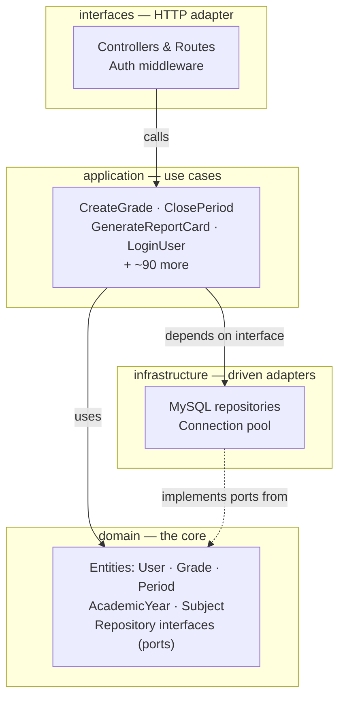

# Academic Grade Management System

A full-stack web application for managing academic records, built on **hexagonal architecture** for
**Colegio San José de Tarbes** (Popayán, Colombia). It replaced a manual spreadsheet workflow and is
used daily by **14 teachers and school administration** to manage records for **~500 students**.


---

## Screenshots

<!-- TODO: replace with real screenshots. Put the image files in docs/screenshots/ -->

| Login | Admin dashboard |
|---|---|
|  |  |

| Grade registration (teacher) | Generated report card |
|---|---|
|  |  |

---

## The problem

The school managed grades across disconnected spreadsheets. Every term, teachers re-entered the same
student data by hand, report cards were assembled manually one student at a time, and there was no
reliable record of who changed a grade or when.

This system centralizes the whole academic cycle — enrollment, subject assignment, grading periods,
grade capture and official report generation — behind role-based access, with a full audit trail on
every grade change.

---

## Features

### Administration
- **Academic years** — create, manage and close school years, with automatic closure when the end date passes
- **Grading periods** — open, close and reopen terms to control when teachers may submit grades
- **Students, groups and subjects** — full CRUD with pagination
- **Enrollments** — assign students to groups per academic year
- **Subject assignments** — map teachers to the subjects and groups they teach
- **Electives** — separate elective subjects, assignments and student enrollments
- **User management** — administrators and teachers, with role-based permissions
- **Dashboard** — aggregate statistics across the active academic year
- **Audit log** — every grade modification is recorded and queryable

### Teachers
- **Grade registration** — capture grades for the assigned subject, group and period
- **Queries** — review submitted grades and student performance
- **Head-teacher reviews** — homeroom teachers submit qualitative reviews per student

### Reporting
Generates official school documents in multiple formats, ready to print or distribute:
- Individual **report cards** and **bulk generation** for an entire group (bundled as a ZIP)
- **Period reports** and **final year reports** in both **Word (.docx)** and **Excel (.xlsx)**
- Attitudinal and elective-subject grade reports
- Alphabetical class lists

### Security
- **JWT** authentication with role-based authorization middleware (`admin`, `docente`)
- Passwords hashed with **bcrypt**
- **Password recovery** by email with expiring reset tokens (Nodemailer)
- Secrets externalized to environment variables — nothing hardcoded

---

## Architecture

The backend follows **hexagonal architecture (ports and adapters)**. Business rules live in the center
and know nothing about Express, MySQL or HTTP. Frameworks and the database are plugged in from the
outside, which means the domain can be tested in isolation and the persistence layer can be swapped
without touching business logic.



**The dependency rule:** arrows point inward. `domain/repositories/UserRepository.js` defines the
contract; `infrastructure/repositories/MySQLUserRepository.js` implements it. Use cases depend on the
interface, never on MySQL directly — so the database is a detail, not a foundation.

### Project structure

```
.
├── app.js                        # Express entry point, mounts 15 API route modules
├── schema.sql                    # Database schema (15 tables)
├── src/
│   ├── domain/
│   │   ├── entities/             # User, Grade, GradeRecord, Period, AcademicYear, Subject…
│   │   └── repositories/         # Ports (interfaces) the infrastructure must implement
│   ├── application/
│   │   └── use-cases/            # One file per operation, grouped by aggregate
│   │       ├── academicYear/  auth/  enrollment/  grade/  gradeRecord/
│   │       ├── group/  period/  student/  subject/  subjectAssignment/
│   │       └── reports/          # Word, Excel and PDF document generation
│   ├── infrastructure/
│   │   ├── database/             # MySQL connection
│   │   └── repositories/         # Concrete MySQL adapters
│   ├── interfaces/
│   │   ├── controllers/          # 15 controllers
│   │   ├── routes/               # 15 REST route modules
│   │   └── middlewares/          # authenticate() / authorize(roles)
│   └── jobs/
│       └── checkYearClosure.js   # Automatic academic-year closure
└── frontend-react/               # React 19 + Vite + Tailwind SPA
    └── src/
        ├── pages/                # Login, AdminDashboard, TeacherDashboard, password reset
        ├── components/           # admin/ · teacher/ · common/ · Layout/
        ├── contexts/             # Auth, ActiveYear, Notification, Refresh
        └── api/client.js         # Axios instance with token interceptor
```

### Data model

15 tables: `academic_years`, `periods`, `users`, `students`, `groups`, `subjects`, `enrollments`,
`subject_assignments`, `grades`, `grade_records`, `grade_audit_logs`, `head_teacher_reviews`,
`elective_subjects`, `elective_assignments`, `student_elective_enrollments`.

Grades are scoped by academic year and period, so historical records stay intact when a new year opens.

---

## Tech stack

| Layer | Technologies |
|---|---|
| **Frontend** | React 19, Vite 8, Tailwind CSS 3, React Router 7, Axios, Heroicons / Lucide |
| **Backend** | Node.js 18+, Express 4 |
| **Database** | MySQL 8 (`mysql2` with connection pooling) |
| **Auth** | JSON Web Tokens, bcrypt |
| **Documents** | `docx` (Word), `exceljs` (Excel), `pdfkit` (PDF), `archiver` (ZIP bundles) |
| **Email** | Nodemailer |
| **Architecture** | Hexagonal (ports & adapters) |

---

## Getting started

### Prerequisites

- Node.js 18 or higher
- MySQL 8.0 or higher

### 1. Clone and install

```bash
git clone https://github.com/Izarm/grade-system-hexagonal-architecture.git
cd grade-system-hexagonal-architecture
npm install
cd frontend-react && npm install && cd ..
```

### 2. Create the database

```bash
mysql -u root -p < proyecto-dependencias/base-de-datos.sql
```

This creates the `sistema_notas` database with all tables and one seed administrator account.

> **Security note:** the seed admin account uses a default password intended for local setup only.
> Change it immediately after the first login, and never deploy with the default in place.

### 3. Configure environment variables

Create a `.env` file in the project root:

```env
# Database
DB_HOST=localhost
DB_PORT=3306
DB_USER=root
DB_PASSWORD=your_mysql_password
DB_NAME=sistema_notas

# Server
PORT=3000

# Auth
JWT_SECRET=a_long_random_secret

# Email (password recovery)
EMAIL_USER=your_email@gmail.com
EMAIL_PASSWORD=your_app_password
```

### 4. Run

Backend, from the project root:

```bash
npm run dev
```

Frontend, in a second terminal:

```bash
cd frontend-react && npm run dev
```

The API runs at `http://localhost:3000/api`.

### Production build

```bash
cd frontend-react && npm run build && cd .. && npm start
```

Express serves the built SPA from `frontend-react/dist`, so the whole app runs on a single port.

---

## API overview

All routes are prefixed with `/api` and, except for authentication, require a `Bearer` token.

| Endpoint | Purpose |
|---|---|
| `/api/auth` | Login, registration, password recovery and reset |
| `/api/academic-years` | Academic year lifecycle, including closure |
| `/api/periods` | Grading period open / close / reopen |
| `/api/students` · `/api/groups` · `/api/subjects` | Core academic entities |
| `/api/enrollments` | Student-to-group assignment per year |
| `/api/subject-assignments` | Teacher-to-subject-and-group mapping |
| `/api/grades` · `/api/grade-records` | Grade definitions and captured grades |
| `/api/head-teacher-reviews` | Homeroom qualitative reviews |
| `/api/reports` | Word / Excel / PDF document generation |
| `/api/dashboard` | Aggregate statistics |
| `/api/users` | User administration |
| `/api/audit-logs` | Grade change history |

---

## What I would improve next

Being honest about the current state, in the order I would tackle it:

- **Automated tests.** The hexagonal layering was chosen partly to make the domain testable, and that
  payoff is still unclaimed. Unit tests on the use cases are the highest-value next step.
- **Input validation at the boundary.** A schema validator (Zod or Joi) in the controllers instead of
  ad-hoc checks.
- **Centralized error handling.** An Express error middleware, replacing per-controller `try/catch`.
- **Refresh tokens.** Access tokens currently carry the whole session.
- **Containerization.** A `docker-compose` setup with the app and MySQL, to remove manual setup steps.
- **CI.** GitHub Actions running lint and tests on every push.

---

## Author

**Zhamuel Alejandro Rosero Montenegro** — Full Stack Developer
Systems Engineering student, Fundación Universitaria de Popayán

[GitHub](https://github.com/Izarm) ·
[LinkedIn](https://www.linkedin.com/in/zhamuel-rosero-montenegro-932252174)

---

## License

MIT — see [LICENSE](LICENSE).
